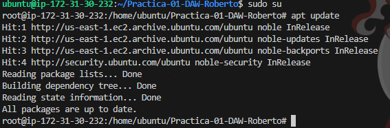
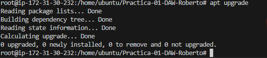
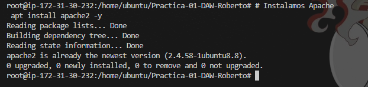
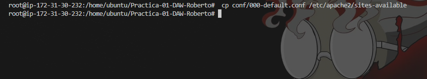
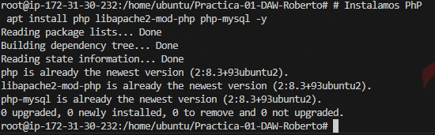
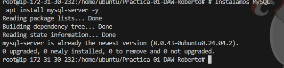
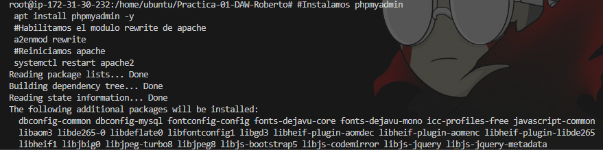

## Índice

1. [Prerrequisitos y preparación del sistema](#prerrequisitos-y-preparación-del-sistema)
2. [Instalación de Apache, PHP y MySQL (LAMP)](#instalación-de-apache-php-y-mysql-lamp)
3. [Instalación de phpMyAdmin](#instalación-de-phpmyadmin)
## Prerrequisitos y preparación del sistema

* **SO**: Ubuntu Server 24.04 LTS (o superior) con usuario con privilegios `sudo`.

Actualizamos índices y paquetes:

```bash
sudo apt update 
sudo apt upgrade -y

```


---

## Instalación de Apache, PHP y MySQL (LAMP)

### 2.1 Apache HTTP Server

Instalamos apache y modificamos su configuracion

```bash
sudo apt install  apache2 -y

 cp conf/000-default.conf /etc/apache2/sites-available
```




---

### 2.2 PHP (módulo para Apache)

Instala PHP 

```bash
 apt install php libapache2-mod-php php-mysql -y
```




### 2.3 MySQL Server

Instalamos MySQL Server:

```bash
 apt install mysql-server -y
```



## Instalación de phpMyAdmin

```bash
#Instalamos phpmyadmin
 apt install phpmyadmin -y
 #Habilitamos el modulo rewrite de apache
 a2enmod rewrite
 #Reiniciamos apache
 systemctl restart apache2
```



